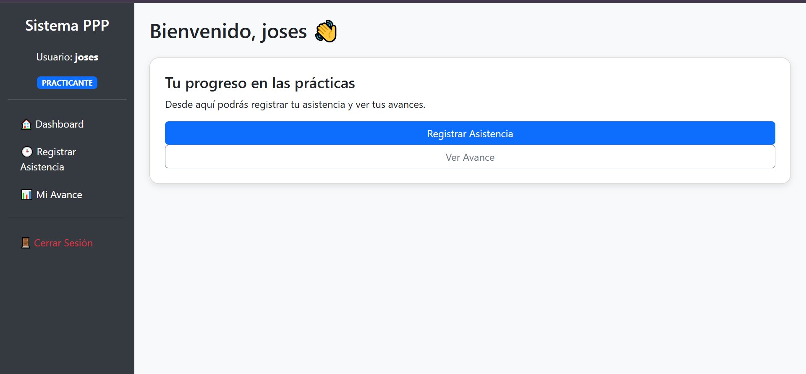

# Dashboard de Recursos Humanos

Sistema web para la gestión integral de practicantes pre-profesionales, desarrollado con PHP, MySQL y Bootstrap 5. El sistema proporciona una plataforma completa para el seguimiento, control y reporte de las prácticas profesionales.

## Vista Previa



> **Nota**: Para agregar la vista previa, toma una captura de pantalla del dashboard y guárdala como `preview.png` en la raíz del proyecto.

## Características

- 👤 Sistema de autenticación multi-rol
- 👥 Gestión completa de practicantes
- 🕒 Registro de asistencia con control de horas
- 📊 Seguimiento de progreso por módulos
- 📄 Generación de reportes PDF profesionales
- 🏫 Gestión de especialidades y módulos académicos
- 📁 Sistema de subida de fotos de perfil

## Tecnologías Utilizadas

- PHP 7.4+
- MySQL 5.7+
- Bootstrap 5.3.2
- FPDF para generación de PDF
- HTML5 / CSS3
- JavaScript

## Estructura del Proyecto

```bash
proyecto/
├── admin_practicante.php                   
├── admin_usuarios.php                    
├── ajax_cargar_modulos.php                  
├── asistencia.php                  
├── avance.php                  
├── conexion.php                   
├── generar_reporte_practicante.php                   
├── index.php                   
├── login.php                    
├── logout.php                   
├── modal_tareas.php                    
├── panel_asistencias.php                 
├── pppga.sql                    
├── css/                        
│   └── ... (archivos de estilos)
├── fpdf/                        
│   └── ... (archivos de la librería)
├── image/                     
│   └── perfil.png/
├── includes/                  
│   ├── conexion.php
│   ├── header.php
│   ├── sidebar.php
│   └── footer.php
├── js/                        
│   └── ... (archivos de funciones)
├── uploads/                     
│   └── fotos_perfil/
└── README.md                   
```

## Componentes Principales

### 1. Sistema de Autenticación

- Roles diferenciados: ADMIN, COORDINADOR, ASISTENTE, PRACTICANTE
- Nóminas
- Login seguro con validación
- Sesiones protegidas
- Compatibilidad con contraseñas hasheadas y en texto plano

### 2. Dashboard Principal

Panel Administrador/Coordinador:
- Estadísticas de practicantes
- Conteo de módulos
- Registros de asistencia
Panel Practicante:
- Acceso rápido a registro de asistencia
- Visualización de progreso
- Historial personal

### 3. Gestión de Practicantes

- Registro de datos personales
- Asignación de especialidades y módulos
- Control de turnos (Diurno/Nocturno)
- Subida de fotografía
- Vinculación con usuario del sistema

### 4. Sistema de Asistencia

- Registro de ingreso y salida
- Cálculo automático de horas trabajadas
- Registro de tareas realizadas
- Estados de asistencia (EN_CURSO/COMPLETADO)
- Firma digital opcional

## Cómo Usar

1. Clona el repositorio
2. Abre `index.php` en tu navegador web
3. Navega por las diferentes secciones del dashboard

## Credenciales de Prueba

Rol	Usuario	Contraseña	Descripción
Administrador	admin	admin	Acceso total al sistema
Coordinador	elmern	1234	Gestión de practicantes y reportes
Practicante	alumnotest	alumnotest	Acceso limitado para registro propio

## Dependencias

- PHP 7.4 o superior (recomendado 8.0+)
- MySQL 5.7+ o MariaDB 10.3+
- Servidor web Apache 2.4+ o Nginx
- Extensión GD para PHP (manipulación de imágenes)

## Personalización

El dashboard puede ser personalizado modificando:

- Los colores y estilos en `css/styles.css`
- La estructura del HTML en `index.php`
- Las gráficas y datos en `/includes/`

---

Desarrollado como parte del curso de Desarrollo Web Backend © 2025
